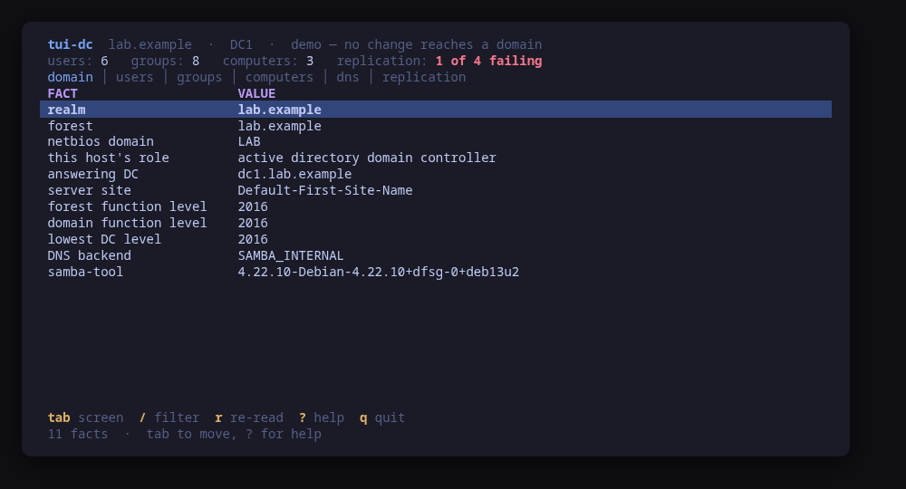
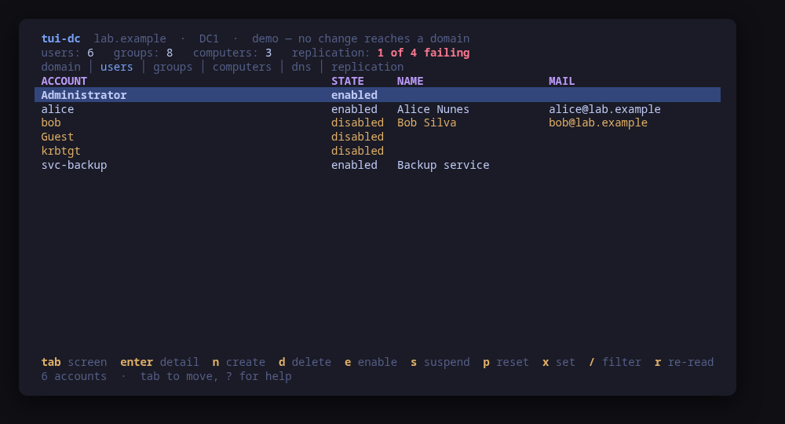
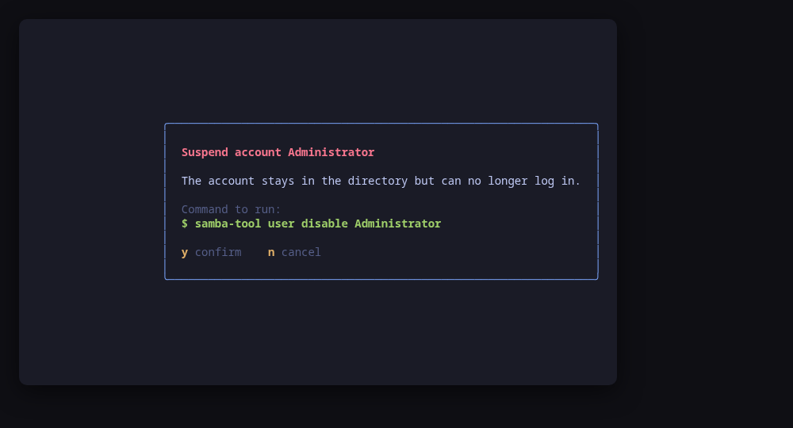

> **Private and unreleased.** This repository is not public yet and nothing has
> been tagged. It has never been run against a real Samba domain controller —
> see [What is still missing](#what-is-still-missing) before trusting it with
> one.

# tui-dc

A Samba Active Directory domain, administered from the terminal.

It opens read-only. One pass over `samba-tool` gives you the domain's name and
functional levels, the role this host plays in it, the accounts, the groups,
the machine accounts, the domain's own DNS zone and the state of replication
per naming context — six screens, one key apart.

Every change is one `samba-tool` command, shown in full and confirmed before it
runs.







```sh
make demo     # a sample domain, on a machine with no Samba on it
```

## No password ever reaches a command line

samba-tool says this itself, every time you give it one:

```
WARNING: Using passwords on command line is insecure.
```

It is right: a command line is visible in `ps` to every user on the machine. So
this tool never builds one. Creating an account and resetting a password both
run with `--random-password`, and what samba-tool printed is what you hand over.
There is a test asserting that no action in the table can ever put a password in
an argv, and it is not there for decoration — it is the rule this tool is built
around and the first thing a new action would break.

## What it does not do

It does not provision, join or demote a domain. Those have no undo, they happen
once in a machine's life, and their command lines are worth reading in a shell
where they can be checked twice.

It is also not a file server tool. The Samba on a domain controller also serves
`sysvol` and `netlogon`, but shares, sessions and the password database are
[tui-samba](https://github.com/tui-tools/tui-samba), and the two do not overlap.

## The six screens

| Screen | What it reads | What it can change |
| --- | --- | --- |
| **domain** | `domain info`, `domain level show`, `testparm` | nothing |
| **users** | `user list`, then `user show` per row | create, delete, enable, suspend, reset password, set expiry |
| **groups** | `group list`, then `group listmembers` per row | create, delete, add member, remove member |
| **computers** | `computer list`, then `computer show` per row | nothing yet |
| **dns** | `dns query <zone> @ ALL` | add record, delete record |
| **replication** | `drs showrepl` | nothing |

The lists are cheap and the detail is not: `user show` is one samba-tool
process per account, and a domain with five hundred of them would take minutes
to open if the tool insisted on knowing everything before drawing anything. So
the tables come from the lists, and the detail is read for the rows actually on
screen, one at a time, following the cursor. A row that has not been read yet
says `?` rather than guessing.

## Install

<!-- install:start -->
<!-- Generated by tui-kit/tools/render-install.py from tool.json. -->
<!-- Edit the manifest, then run `make readme`. -->

### From source

```sh
git clone https://github.com/tui-tools/tui-dc
cd tui-dc && make demo
```

`make demo` runs against a sample domain, so it needs no Samba at all.

Not packaged for these yet; the static binary works everywhere in the meantime.

### Arch Linux — coming soon

Needs the tui-tools repository, which is a [one-time
setup](https://tui-tools.github.io/install/).

The one-liner detects the distribution and adds the repository and its signing
key:

```sh
curl -fsSL https://pkgs.tui.tools/install.sh | sh
```

Piping a script into a shell is not this family's style, so here is the same
setup by hand — read it, or read the script first with `curl -fsSL
https://pkgs.tui.tools/install.sh -o install.sh`:

```sh
curl -fsSL -o /tmp/tui-tools.asc https://pkgs.tui.tools/pubkey.asc
sudo pacman-key --add /tmp/tui-tools.asc
sudo pacman-key --lsign-key \
  "$(gpg --show-keys --with-colons /tmp/tui-tools.asc | awk -F: '/^fpr:/{print $10; exit}')"
printf '[tui-tools]\nServer = https://pkgs.tui.tools/arch/$arch\n' \
  | sudo tee -a /etc/pacman.conf
sudo pacman -Sy
```

Then, and for every other tool in the family:

```sh
sudo pacman -S tui-dc
```

Not released yet. The channel turns available once the first release lands in
pkgs.tui.tools.

### Debian and Ubuntu — coming soon

Needs the tui-tools repository, which is a [one-time
setup](https://tui-tools.github.io/install/).

The one-liner detects the distribution and adds the repository and its signing
key:

```sh
curl -fsSL https://pkgs.tui.tools/install.sh | sh
```

Piping a script into a shell is not this family's style, so here is the same
setup by hand — read it, or read the script first with `curl -fsSL
https://pkgs.tui.tools/install.sh -o install.sh`:

```sh
sudo install -d -m 0755 /etc/apt/keyrings
curl -fsSL https://pkgs.tui.tools/pubkey.asc \
  | sudo gpg --dearmor -o /etc/apt/keyrings/tui-tools.gpg
echo "deb [signed-by=/etc/apt/keyrings/tui-tools.gpg] https://pkgs.tui.tools/deb stable main" \
  | sudo tee /etc/apt/sources.list.d/tui-tools.list
sudo apt update
```

Then, and for every other tool in the family:

```sh
sudo apt install tui-dc
```

Not released yet. The channel turns available once the first release lands in
pkgs.tui.tools.

### Fedora and RHEL — coming soon

Needs the tui-tools repository, which is a [one-time
setup](https://tui-tools.github.io/install/).

The one-liner detects the distribution and adds the repository and its signing
key:

```sh
curl -fsSL https://pkgs.tui.tools/install.sh | sh
```

Piping a script into a shell is not this family's style, so here is the same
setup by hand — read it, or read the script first with `curl -fsSL
https://pkgs.tui.tools/install.sh -o install.sh`:

```sh
sudo rpm --import https://pkgs.tui.tools/pubkey.asc
sudo curl -fsSL -o /etc/yum.repos.d/tui-tools.repo https://pkgs.tui.tools/rpm/tui-tools.repo
sudo dnf makecache
```

Then, and for every other tool in the family:

```sh
sudo dnf install tui-dc
```

Not released yet. The channel turns available once the first release lands in
pkgs.tui.tools.

### Any distribution, static binary — coming soon

```sh
curl -fsSL https://github.com/tui-tools/tui-dc/releases/download/v{version}/tui-dc_{version}_linux_amd64.tar.gz | tar -xz tui-dc
sudo install -m0755 tui-dc /usr/local/bin/tui-dc
```

Not released yet.

### Verify a download

Every release of `tui-dc` ships a `checksums.txt`. Check an archive against it
before installing:

```sh
sha256sum -c checksums.txt --ignore-missing
```
<!-- install:end -->

## Configuration

```toml
# /etc/tui-dc/config.toml or ~/.config/tui-dc/config.toml
server = "127.0.0.1"   # the controller to read; this host by default
sudo   = "sudo -n"     # "" to run without escalation
theme  = ""            # path to an Omarchy-style colors.toml
```

Every key can also be set as `TUI_DC_SERVER`, `TUI_DC_SUDO`, `TUI_DC_THEME`, or
passed as a flag, which wins over both.

Reads escalate. samba-tool opens the directory database directly and that
database is readable only by root, so there is no unprivileged read path to fall
back on. A machine where escalation is refused says so at startup rather than
showing an empty domain.

## Non-interactive

```sh
tui-dc --check    # the read path, once, as JSON — no UI, no changes
tui-dc --report   # the versions and machine facts a bug report needs
tui-dc --demo     # a sample domain, no Samba required
```

`--check` is safe to run anywhere, including in CI against a production-shaped
machine: it never builds and never runs a mutation. A machine with no Samba on
it answers `"installed": false` with the reason beside it, which is the true
answer for most machines and not a failure.

## Compatibility

<!-- compat:start -->
<!-- Generated by tui-kit/tools/render-compat.py from tool.json. -->
<!-- Edit the manifest, then run `make readme`. -->

`tui-dc` probes its backend once at startup and shows the version in the
header. A version nobody has tested is marked `(untested)` there rather than
hidden; one below the minimum is marked as such and the tool still runs.

### samba

| | |
| --- | --- |
| Binary | `samba-tool` |
| Version read with | `samba-tool --version` |
| Minimum | 4.13 |
| Tested | none yet |
| Version-gated features | `computer-subcommand` (since 4.8) |

| Versions | What changes |
| --- | --- |
| `<4.8` | `samba-tool computer` does not exist, so the computers screen is empty |
| `<4.13` | untested: the output of `domain info`, `dns query` and `drs showrepl` has changed shape across releases and the parsers are only checked against 4.19 and 4.22 |

The tested versions are generated from `compat/results.jsonl`, which the tool's
own smoke test appends to when it runs against a real machine in
[tui-lab](https://github.com/tui-tools/tui-lab).
<!-- compat:end -->

## What is still missing

Honest list, because this repository is private for exactly this reason:

- **It has never run against a real domain controller.** `samba-tool domain
  provision` cannot complete inside an unprivileged container — it panics at the
  sysvol ACL step — so the fixtures for `domain info`, `dns query` and `drs
  showrepl` are constructed from the documented formats rather than captured.
  Everything else in [`internal/samba/testdata`](internal/samba/testdata) is
  real output from a throwaway DC, and that directory's README says which is
  which. A real DC in [tui-lab](https://github.com/tui-tools/tui-lab) replaces
  the three constructed ones, and until it has, no version belongs in `tested`.
- **The computers screen is read-only.** `samba-tool computer create` and
  `computer delete` are obvious next actions and were left out of phase one
  deliberately: a machine account deleted by accident takes a domain member off
  the domain.
- **No FSMO, no sites, no GPO, no trusts, no OU tree.** `samba-tool fsmo show`
  belongs on the domain screen and is the most obvious gap. The accounts and
  groups screens show a flat list, so an OU structure is invisible.
- **No screenshots from a real domain.** The ones above are `--demo`.

## Development

```sh
make check         # gofmt, vet, the exec boundary, golangci-lint, tests
make demo          # the UI, against the sample domain
make manifest      # validate tool.json against the family schema
make screenshots   # re-render the README frames from --demo
go test -fuzz FuzzParseShowRepl ./internal/samba/
```

`make check` is what CI runs. The exec boundary check is the one worth
understanding: only `internal/samba` may start a process, so the command the
confirm dialog showed and the command that runs are provably the same value.

| In this repository | What it is |
| --- | --- |
| `cmd/tui-dc/main.go` | Flags, configuration, backend selection, program start |
| `cmd/tui-dc/app.go` | The Bubble Tea model: one flat update loop over six screens |
| `cmd/tui-dc/view.go` | The bands every screen draws, and the six tables |
| `cmd/tui-dc/check.go` | `--check`: the read path as JSON |
| `cmd/tui-dc/report.go` | `--report`: the block a bug report pastes |
| `internal/directory/` | The model, the action table, and the one function that builds a command line |
| `internal/samba/` | The only place a process is started: samba-tool, its parsers, and the fake |
| `internal/samba/testdata/` | Real captured samba-tool output, and the three constructed files, labelled |
| `test/smoke.sh` | The assertions the lab runs against a real machine |

## License

MIT.
